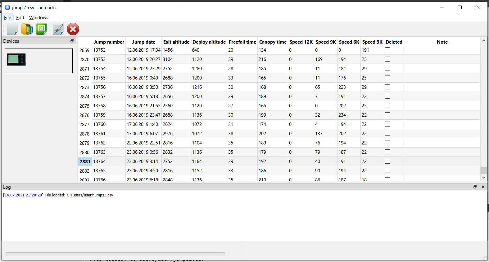
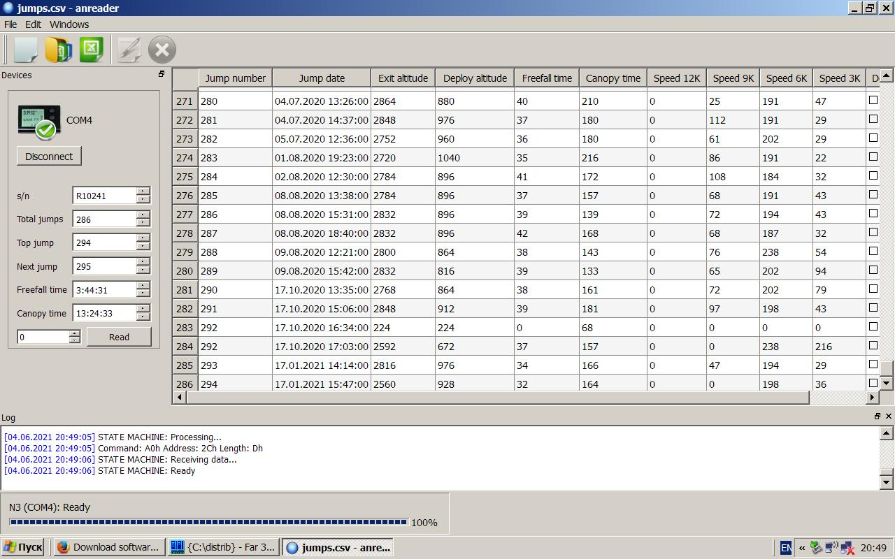
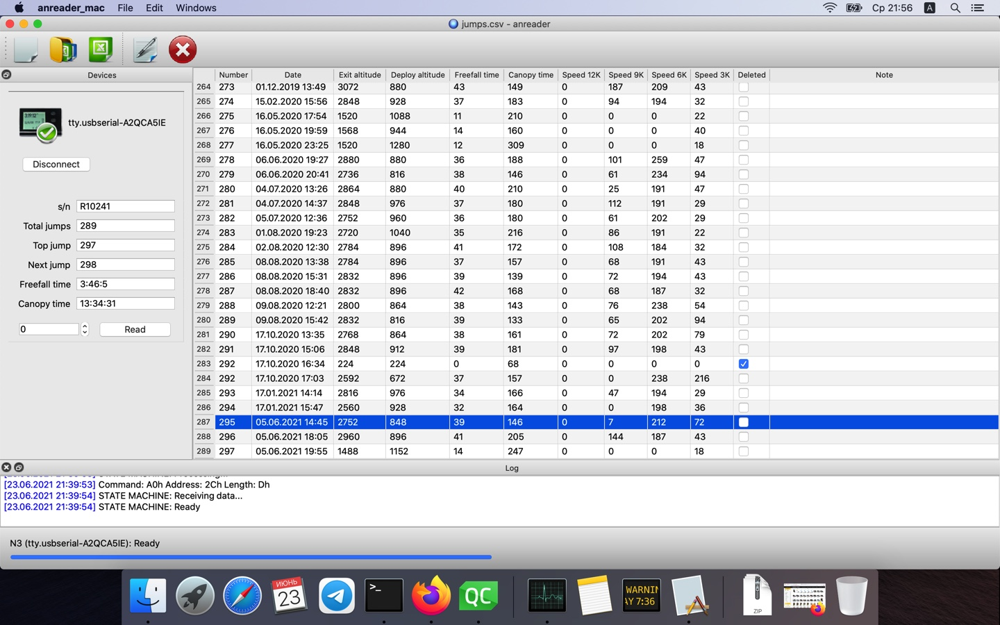

# anreader

ANReader - кросплатформенный GUI-клиент к высотнику-пищалке Atlas/Neptune.
Приложение работает на следующих операционных системах: Windows 7, Windows 10 (отдельно собирается для Windows XP), Linux, FreeBSD, macOS.

## Ссылки

[Описание протокола от Алексея Лобанова](https://sites.google.com/site/lobanovsoftware/) - описание протокола обмена с прибором (немного устарело). Громадная работа Алексея.
[N3Reader](https://github.com/ffkirill/n3reader) - кое-какие идеи почерпнул отсюда.
[Altimaster USB Driver](https://www.dropbox.com/s/2ju5dvbgn5kohc1/AltimasterUSBDrivers.msi?dl=0) - для Windows XP и Windows 7 надо будет установить драйвер. Для Windows 10, скорее всего, не понадобится, она все сделает сама.
[VCP driver](https://ftdichip.com/drivers/vcp-drivers/) - для macOs надо скачать подходящий драйвер. На Big Sur драйвер пока не работает.

## Использование

При наличии в системе соответствующего драйвера (для Linux, FreeBSD ничего отдельно ставить не нужно) подключаем прибор к usb-порту, запускаем программу. Или сперва запускаем, потом подключаем. Прибор должен определиться сам.

## Скриншоты

### Windows 10

### Windows XP

### macOS

## Лицензия
[BSD](https://choosealicense.com/licenses/bsd-2-clause/)
